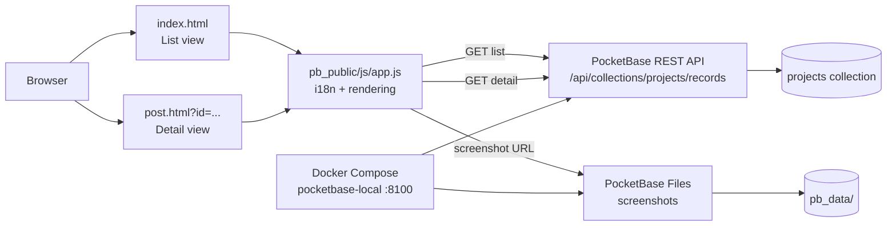

# Pro Index

Public project directory built with a static frontend and PocketBase. The application displays a list of projects, lets users open each record's details, and provides links to the code repository and the project's public URL.

## Features

- Project listing from the PocketBase `projects` collection.
- Detail view through `post.html?id=<project-id>`.
- Descriptions in Spanish, English, and French based on the browser's preferred language.
- Project images served from PocketBase files.
- Links to the repository and public URL.
- Bootstrap 5 and Bootstrap Icons served locally.
- Responsive design for desktop and mobile devices.

## Requirements

- Docker and Docker Compose.
- Node.js and npm to run ESLint locally.

## Configuration

1. Create the `.env` file from `.env.example`:

   ```bash
   cp .env.example .env
   ```

2. Set your own administrator credentials in `.env`:

   ```env
   PB_ADMIN_EMAIL=admin@localhost.local
   PB_ADMIN_PASSWORD=replace-with-a-generated-secret
   ```

    Do not upload `.env` to the repository. The file is excluded through `.gitignore`.

## Running with Docker

Start PocketBase together with the static frontend:

```bash
docker compose up -d
```

The application will be available at:

- Frontend: <http://localhost:8100>
- PocketBase admin dashboard: <http://localhost:8100/_/>

To stop the container:

```bash
docker compose down
```

Persistent PocketBase data is stored in `pb_data/` and mounted into the container through Docker Compose.

## Development and validation

Install the Node.js dependencies:

```bash
npm install
```

Run ESLint on the frontend:

```bash
npm run lint
```

Apply the available automatic fixes:

```bash
npm run lint:fix
```

You can also check the JavaScript syntax directly:

```bash
node --check pb_public/js/app.js
```

## Project data

The application queries the public PocketBase API through:

```text
/api/collections/projects/records
```

The `projects` collection must provide at least the following fields:

- `id`: record identifier.
- `name`: project name.
- `description_es`, `description_en`, and `description_fr`: translated descriptions.
- `languages`: language or multi-select language field.
- `tech_stack`: multi-select technology field.
- `screenshot`: image filename, if available.
- `collectionId`: collection identifier used to build the file URL.
- `repo`: code repository URL.
- `public`: public project URL.
- `is_public`: boolean visibility flag. Only records with `is_public = true` are exposed on the public website and through public PocketBase list/detail rules.
- `schema`: project-specific Mermaid diagram, displayed in the detail view.

The `languages` and `tech_stack` fields may be received as single values or arrays. The frontend normalizes both cases before rendering the badges.

The `is_public` field is created by the PocketBase migration `20260922120000_add_project_visibility.js` when the `projects` collection already exists. Existing records default to private (`false`), so publish each project intentionally from the PocketBase dashboard.

The `schema` field must contain only the diagram's Mermaid code. For example:

````text
flowchart LR
    browser["Browser"] --> app["Frontend"]
    app --> api["PocketBase API"]
    api --> data[("projects")]
````

The detail view loads Mermaid locally and renders the diagram associated with the record. If a project does not have `schema`, the diagram section is not displayed. For compatibility with existing records, the `diagram` and `architecture` fields are also accepted, although `schema` is the recommended name.

## Visitor tracking

The application records each page load in the PocketBase `visitors` collection. The collection is created automatically by a native PocketBase migration. It stores the visited page path, server-captured IP address, User-Agent, referrer, accepted languages, browser language, platform, screen size, and time zone.

The PocketBase server hook removes visitor records older than seven days once per day. Visitor records can be created publicly by the frontend, but they cannot be listed, viewed, edited, or deleted through the public API. When the site is behind Traefik, the server hook uses the first address in `X-Forwarded-For` (or `X-Real-IP`) as the visitor IP and falls back to the direct connection address. Browser metadata is sent by the frontend. The hook is loaded automatically when PocketBase starts.

The collection itself is created by a native PocketBase migration, so visitor registration does not depend on an administrator login. If an existing installation was started before this migration was added, restart PocketBase once to apply it.

## Project structure

```text
.
├── docker-compose.yml       # PocketBase service and persistent volumes
├── .env.example             # Example environment variables
├── eslint.config.mjs        # ESLint configuration
├── package.json              # Development scripts and dependencies
├── pb_hooks/                 # PocketBase server hooks
├── pb_migrations/            # PocketBase schema migrations
├── data/                    # Generated/local PocketBase declarations
├── pb_data/                 # Persistent PocketBase data, not versioned
└── pb_public/
    ├── index.html           # List view
    ├── post.html            # Detail view
    ├── privacy.html         # Privacy information
    ├── css/
    │   ├── bootstrap.min.css
    │   ├── bootstrap-icons.min.css
    │   ├── fonts/           # Bootstrap Icons fonts
    │   └── styles.css       # Custom styles
    └── js/
        ├── app.js           # i18n, API queries, and rendering
        ├── bootstrap.bundle.min.js
        └── mermaid.min.js    # Mermaid diagram rendering
```

## Architecture



### Navigation flow

1. `index.html` loads `app.js` and requests the `projects` records.
2. `app.js` prepares the data, applies the browser language, and generates the cards in a `DocumentFragment`.
3. Each project links to `post.html?id=<id>`.
4. In the detail view, `app.js` requests a single record and renders its complete information.
5. Screenshots are resolved through the PocketBase file path.

## Security notes

- Use a long, unique password for `PB_ADMIN_PASSWORD`.
- Keep `.env` out of version control.
- Review the access rules for the `projects` collection before deploying the project publicly.
- Do not expose the PocketBase admin dashboard without additional protection in a production environment.
