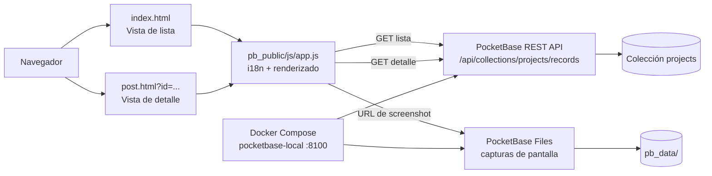

# Pro Index

Directorio público de proyectos construido con un frontend estático y PocketBase. La aplicación muestra una lista de proyectos, permite abrir el detalle de cada registro y ofrece enlaces al repositorio de código y a la URL pública del proyecto.

## Características

- Listado de proyectos desde la colección `projects` de PocketBase.
- Vista de detalle mediante `post.html?id=<project-id>`.
- Descripciones en español, inglés y francés según el idioma preferido del navegador.
- Imágenes de proyecto servidas desde los archivos de PocketBase.
- Enlaces a repositorio y URL pública.
- Bootstrap 5 y Bootstrap Icons servidos localmente.
- Diseño responsive para escritorio y dispositivos móviles.

## Requisitos

- Docker y Docker Compose.
- Node.js y npm para ejecutar ESLint localmente.

## Configuración

1. Crea el archivo `.env` a partir de `.env.example`:

   ```bash
   cp .env.example .env
   ```

2. Define credenciales de administrador propias en `.env`:

   ```env
   PB_ADMIN_EMAIL=admin@localhost.local
   PB_ADMIN_PASSWORD=replace-with-a-generated-secret
   ```

   No subas `.env` al repositorio. El archivo está excluido mediante `.gitignore`.

## Ejecución con Docker

Inicia PocketBase junto con el frontend estático:

```bash
docker compose up -d
```

La aplicación estará disponible en:

- Frontend: <http://localhost:8100>
- Panel de administración de PocketBase: <http://localhost:8100/_/>

Para detener el contenedor:

```bash
docker compose down
```

Los datos persistentes de PocketBase se almacenan en `pb_data/` y se montan en el contenedor mediante Docker Compose.

## Desarrollo y validación

Instala las dependencias de Node.js:

```bash
npm install
```

Ejecuta ESLint sobre el frontend:

```bash
npm run lint
```

Aplica las correcciones automáticas disponibles:

```bash
npm run lint:fix
```

También puedes comprobar la sintaxis de JavaScript directamente:

```bash
node --check pb_public/js/app.js
```

## Datos de proyectos

La aplicación consulta la API pública de PocketBase mediante:

```text
/api/collections/projects/records
```

La colección `projects` debe proporcionar, como mínimo, estos campos:

- `id`: identificador del registro.
- `name`: nombre del proyecto.
- `description_es`, `description_en` y `description_fr`: descripciones traducidas.
- `languages`: lenguaje o selección múltiple de lenguajes.
- `tech_stack`: selección múltiple de tecnologías.
- `screenshot`: nombre del archivo de imagen, si existe.
- `collectionId`: identificador de la colección usado para construir la URL del archivo.
- `repo`: URL del repositorio de código.
- `public`: URL pública del proyecto.
- `schema`: esquema Mermaid específico del proyecto, mostrado en la vista de detalle.

Los campos `languages` y `tech_stack` pueden recibirse como valores únicos o como arrays. El frontend normaliza ambos casos antes de renderizar las insignias.

El campo `schema` debe contener únicamente el código Mermaid del diagrama. Por ejemplo:

````text
flowchart LR
    browser["Navegador"] --> app["Frontend"]
    app --> api["PocketBase API"]
    api --> data[("projects")]
````

La vista de detalle carga Mermaid localmente y renderiza el esquema asociado al registro. Si un proyecto no tiene `schema`, la sección del diagrama no se muestra. Como compatibilidad con registros existentes, también se aceptan los campos `diagram` y `architecture`, aunque `schema` es el nombre recomendado.

## Estructura del proyecto

```text
.
├── docker-compose.yml       # Servicio de PocketBase y volúmenes persistentes
├── .env.example             # Variables de entorno de ejemplo
├── eslint.config.mjs        # Configuración de ESLint
├── package.json              # Scripts y dependencias de desarrollo
├── data/                    # Declaraciones generadas/locales de PocketBase
├── pb_data/                 # Datos persistentes de PocketBase, no versionados
└── pb_public/
    ├── index.html           # Vista de lista
    ├── post.html            # Vista de detalle
    ├── css/
    │   ├── bootstrap.min.css
    │   ├── bootstrap-icons.min.css
    │   ├── fonts/           # Fuentes de Bootstrap Icons
    │   └── styles.css       # Estilos propios
    └── js/
        ├── app.js           # i18n, consulta API y renderizado
        ├── bootstrap.bundle.min.js
        └── mermaid.min.js    # Renderizado de esquemas Mermaid
```

## Arquitectura



### Flujo de navegación

1. `index.html` carga `app.js` y solicita los registros de `projects`.
2. `app.js` prepara los datos, aplica el idioma del navegador y genera las tarjetas en un `DocumentFragment`.
3. Cada proyecto enlaza a `post.html?id=<id>`.
4. En la vista de detalle, `app.js` solicita un único registro y renderiza su información completa.
5. Las capturas se resuelven mediante la ruta de archivos de PocketBase.

## Notas de seguridad

- Usa una contraseña larga y única para `PB_ADMIN_PASSWORD`.
- Mantén `.env` fuera del control de versiones.
- Revisa las reglas de acceso de la colección `projects` antes de desplegar el proyecto públicamente.
- No expongas el panel de administración de PocketBase sin protección adicional en un entorno de producción.
